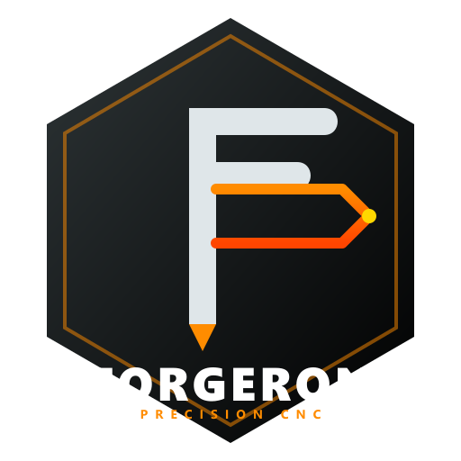

# Forgeron — Contrôleur CNC 5-Axes Industriel

<p align="center">
  
</p>

**Forgeron** est une application Flutter de grade industriel conçue pour le pilotage haute performance de machines CNC 5-axes (configuration Trunnion X,Y,Z,A,C). Optimisée pour le firmware **FluidNC v3.7+**, elle garantit un usinage sans saccades et une sécurité matérielle accrue.

## 🔌 Connexion à l'ESP32 FluidNC

### Protocole WebSocket
- **URL** : `ws://<IP_ESP32>:80/` (port 80, slash final obligatoire)
- **Format** : FluidNC envoie des **frames binaires WebSocket** (pas du texte) → décodage UTF-8 automatique dans l'application
- **Heartbeat** : commande `?` toutes les 2s, timeout déconnexion à 10s

### Découverte automatique
1. Aller dans **Connexion** → cliquer **SCANNER**
2. L'application scanne le sous-réseau local (priorité aux IPs .200, .100, .1...)
3. Cliquer **CONNECTER** sur le device trouvé
4. L'état passe à **EN LIGNE** avec l'IP affichée dans la barre du haut

### Configuration manuelle
- Entrer l'IP manuellement dans le champ **Adresse IP**
- Port par défaut : **80**
- URL WebSocket calculée automatiquement : `ws://IP:80/`

---

## 🚀 Fonctionnalités

### 1. Contrôle machine temps réel
- **DRO Live** : X, Y, Z, A, C mis à jour depuis les status reports FluidNC `<Idle|MPos:...>`
- **JOG 5 axes** : boutons X±/Y±/Z± et A±/C± avec pas configurable (0.001 → 100mm)
- **Commandes temps réel** : STOP jog (`0x85`), PAUSE (`!`), REPRISE (`~`), RESET (`Ctrl-X`)
- **Alarme** : déverrouillage automatique via `$X` avant les commandes critiques

### 2. Macros multi-lignes
Les macros G-Code multi-lignes sont envoyées ligne par ligne avec 200ms d'intervalle :
- PALPAGE CENTRE A, CHANGEMENT OUTIL, NETTOYAGE PLATEAU, WARMUP BROCHE

### 3. WCS (Systèmes de coordonnées)
- Cliquer sur G54/G55/G56 dans l'onglet Palpage & Origines envoie la commande à la machine

### 4. Streaming G-Code
- **Character-Counting** : gestion du buffer RX (127 octets) pour streaming continu
- **Virtualisation UI** : ListView avec `itemExtent` fixe pour des fichiers de millions de lignes

### 5. Résilience réseau
- **Reconnexion Exponential Backoff** : 1s, 2s, 4s... plafonné à 30s
- **Heartbeat Watchdog** : `?` toutes les 2s, timeout à 10s (assez long pour les jogs)

---

## 🔧 Hardware Cible — Prototype PFE

| Composant | Référence |
|-----------|-----------|
| Contrôleur | ESP32 DevKit V1 (30 broches) |
| Firmware | FluidNC v3.7+ |
| Drivers moteur | 5× TB6600 (STEP/DIR) |
| Axes | X, Y, Z (linéaires) + A, C (rotatifs Trunnion) |

### Câblage GPIO ESP32 → TB6600

| Axe | STEP GPIO | DIR GPIO |
|-----|-----------|----------|
| X   | GPIO 26   | GPIO 27  |
| Y   | GPIO 25   | GPIO 33  |
| Z   | GPIO 32   | GPIO 23  |
| A   | GPIO 19   | GPIO 18  |
| C   | GPIO 17   | GPIO 16  |
| ENA (partagé ×5) | **GPIO 22** | — |

### Fins de course & broche

| Fonction | GPIO | Câblage / config |
|----------|------|------------------|
| Fin de course X | GPIO 4  | switch NO → GND, pull-up interne (`gpio.4:low:pu`) |
| Fin de course Y | GPIO 13 | switch NO → GND (`gpio.13:low:pu`) |
| Fin de course Z | GPIO 14 | switch NO → GND (`gpio.14:low:pu`) |
| Broche DC (relais) | GPIO 21 | signal 3.3 V → IN du module relais, tout-ou-rien (`Relay: output_pin`). `M3`=ON, `M5`=OFF |

> `hard_limits` reste à `false` tant que le câblage n'est pas validé via l'écran **Fins de course → Test**. GPIO 5 / 15 restent libres pour d'éventuels switches A et C.

**Config FluidNC** : `scratch/config_5axes_production.yaml`

---

## 📦 Installation & Lancement

```bash
flutter pub get
flutter run -d windows    # Application bureau Windows
```

> ⚠️ Le message "Nuget is not installed" lors du build Windows est bénin et n'empêche pas la compilation.

---

## 📁 Structure du projet

```
lib/
├── application/
│   ├── providers/          # Riverpod providers (machine, jog, gcode...)
│   └── services/           # Auto-découverte mDNS/HTTP
├── data/
│   ├── fluidnc/            # Connexion WebSocket + parser GRBL
│   └── mock/               # Repository simulation (mode hors connexion)
├── domain/
│   ├── models/             # MachineState, JogCommand, Macro...
│   └── repositories/       # Interface MachineRepository
└── presentation/
    ├── screens/            # Dashboard, Palpage, Terminal MDI...
    └── widgets/            # Visualiseur 3D Trunnion, GlassPanel...

scratch/
├── config_5axes.yaml            # Config FluidNC test (null_motor)
├── config_5axes_production.yaml # Config FluidNC production (TB6600 réel)
└── current_config.yaml          # Sauvegarde config originale ESP32
```

---
*Projet de Fin d'Études (PFE) — ENI — Configuration Trunnion 5-Axes.*
